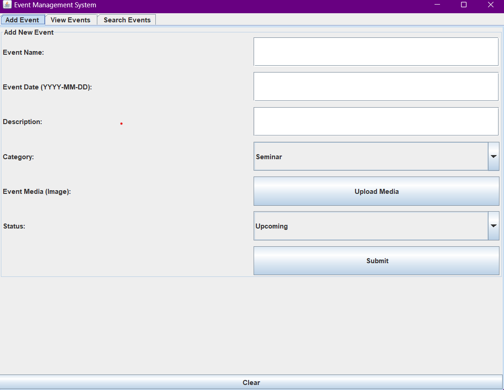
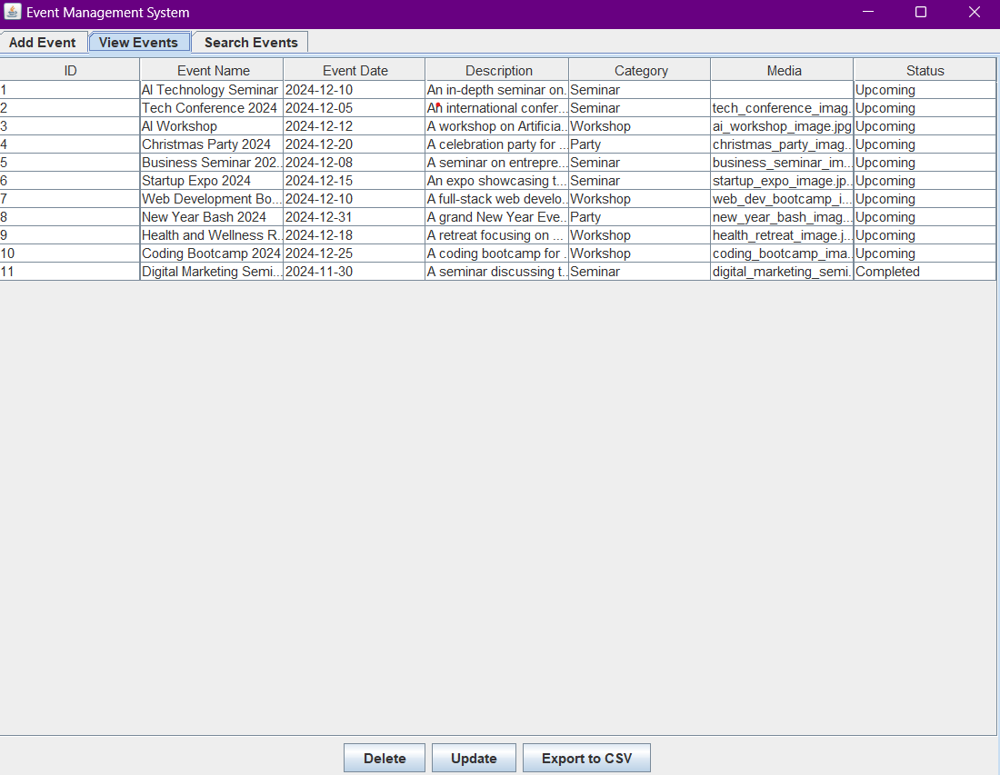
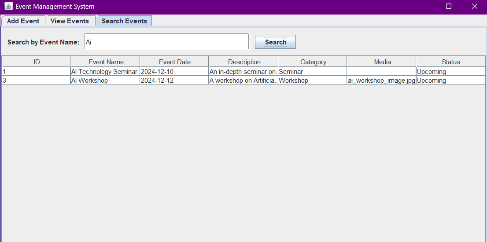

# Event Management System

This Java-based desktop application provides a comprehensive Event Management System with features to add, view, update, delete, search, and export events.

## Features

1. **Add Events**:
    - Users can add new events by providing details like Event Name, Date, Description, Category, Media, and Status.
    - Media files can be uploaded (image files like JPG, PNG, and GIF).

2. **View Events**:
    - Displays all events in a table format.
    - Users can update or delete existing events.

3. **Search Events**:
    - Search events by their name using the search functionality.

4. **Export to CSV**:
    - Export event data to a CSV file.

5. **Event Status Management**:
    - Categorize events into "Upcoming," "Ongoing," and "Completed".

## Technology Stack

- **Programming Language**: Java
- **Database**: MySQL
- **UI Framework**: Swing

## Setup Instructions

### Prerequisites
- Java Development Kit (JDK) installed.
- MySQL Server installed.
- IDE (e.g., IntelliJ IDEA, Eclipse, or VS Code).

### Database Setup
1. Create a MySQL database named `event_management`.
2. Use the following SQL script to create the `events` table:

```sql
CREATE TABLE events (
    id INT AUTO_INCREMENT PRIMARY KEY,
    event_name VARCHAR(255) NOT NULL,
    event_date DATE NOT NULL,
    event_description TEXT,
    category VARCHAR(50),
    media_path VARCHAR(255),
    status VARCHAR(50)
);
```

### How to Run
1. Clone or download this repository.
2. Open the project in your preferred IDE.
3. Configure the database connection:
    - Update `DB_URL`, `DB_USER`, and `DB_PASSWORD` in the code.
4. Run the `EventManagementApp` class.

### Usage
- Use the `Add Event` tab to add new events.
- View all events in the `View Events` tab, where you can also update or delete events.
- Search for events by name in the `Search Events` tab.
- Export all events to a CSV file using the export button.

## Screenshots

### Event Registration Page


### Home Page


### Search Event Page



