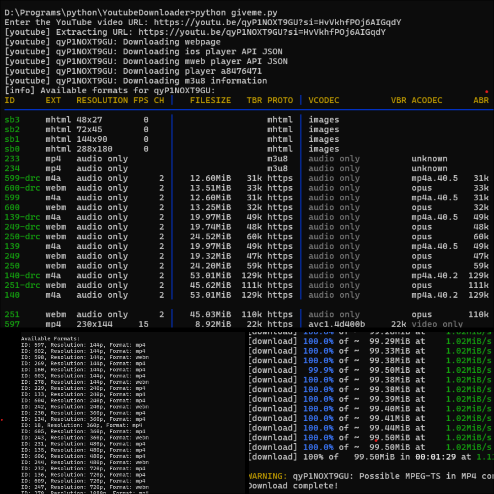

# 🎥 YouTube Video Downloader with Quality Selection  

A Python-based YouTube video downloader that allows users to select their desired video quality (e.g., 240p, 360p, 720p, etc.) before downloading. This project uses the powerful **yt-dlp** library for downloading videos and ensures a seamless experience with format selection.

---

## 🚀 Features  

- **Dynamic Quality Selection**: Lists all available video formats and resolutions for the selected YouTube video.  
- **Customizable Downloads**: Download videos in your preferred resolution or quality (e.g., 240p, 360p, 720p).  
- **Error Handling**: Handles potential issues like malformed AAC timestamps by integrating with **FFmpeg**.  
- **Cross-Platform**: Runs on Windows, macOS, and Linux.  

---

## 🔧 Requirements  

- **Python 3.7+**  
- **yt-dlp**: Install using `pip install yt-dlp`  
- **FFmpeg** (optional but recommended for fixing certain video/audio encoding issues):  //optional
  - [Install FFmpeg](https://ffmpeg.org/download.html)  

---

## 📦 Installation  

1. Clone this repository:  
   ```bash
   git clone https://github.com/Surya-2k4/College-Projects/tree/main/YtVideoDownloader
   cd YtVideoDownloader
   ```

2. Install dependencies:  
   ```bash
   pip install yt-dlp
   ```

3. Ensure FFmpeg is installed and available in your system's PATH. 

---

## 🛠 Usage  

1. Run the script:  
   ```bash
   python giveme.py
   ```

2. Enter the YouTube video URL when prompted.  

3. View the list of available video formats and resolutions.  

4. Enter the desired format ID to start downloading.  

---

## 📝 Example  

```bash
Enter the YouTube video URL: https://www.youtube.com/watch?v=example
Available Formats:
ID: 18, Resolution: 360p, Format: mp4
ID: 22, Resolution: 720p, Format: mp4
ID: 137, Resolution: 1080p, Format: mp4
ID: 399, Resolution: 2160p, Format: mp4

Choose a format ID from the list above:
Enter the desired format ID: 22
Downloading video in format ID 22...
Download complete!
```

---

## 📂 Project Structure  

```
📁 youtube-video-downloader  
├── giveme.py               # Main script  
├── requirements.txt        # Dependencies  
└── README.md               # Project documentation  
```

---

## 💡 Future Enhancements  

- Add a graphical user interface (GUI) for easier interaction.  
- Enable batch downloads from playlists.  
- Include options for downloading only audio files.  

---

## 🤝 Contributing  

Contributions are welcome! If you'd like to improve this project, feel free to fork the repository and create a pull request.  

---

## 📸 Output  

Here’s how the application works:  



> The above image showcases the video download process, listing available formats and resolutions, and successfully downloading the chosen video.


### 🌟 Acknowledgments  

- [yt-dlp](https://github.com/yt-dlp/yt-dlp) for video downloading capabilities.  
- [FFmpeg](https://ffmpeg.org/) for handling video/audio processing. //optional for this project


